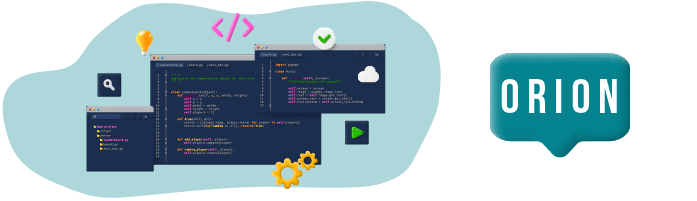

# MDD Application



## Required dependencies

- "@angular/cdk": "^20.1.6",
- "@angular/common": "^19.0.0",
- "@angular/compiler": "^19.0.0",
- "@angular/core": "^19.0.0",
- "@angular/forms": "^19.0.0",
- "@angular/platform-browser": "^19.0.0",
- "@angular/platform-browser-dynamic": "^19.0.0",
- "@angular/router": "^19.0.0",
- "@fortawesome/angular-fontawesome": "1.0.0",
- "@fortawesome/free-regular-svg-icons": "^6.7.1",
- "@fortawesome/free-solid-svg-icons": "^6.7.2",
- "rxjs": "~7.8.0",
- "tslib": "^2.3.0",
- "zone.js": "~0.15.0"

## Install and launch the Front-End :

1. Clone the repository:   
   `git clone https://github.com/Protazer/Developpez-une-application-full-stack-complete

2. move to front folder `cd front`
3. Install dependencies :   
   `npm install / yarn install`

4. Launch the Front-End on port 4200:   
   `npm start / yarn start`

5. The application is now available at this adress `http://localhost:4200`.

## Install and launch the Back-End :

[](https://forthebadge.com)
[](https://forthebadge.com)

## Configuration

Generate RSA key to resources project folder for JWT Security.

```
cd src/main/resources
openssl genrsa > private.key
openssl rsa -in private.key -pubout -out public.key 
```

Create a `.env` file (in project root directory), containing variables according
to
`.env.schema`.

```
#API PORT
    TOMCATS_PORT=myPort

#DATABASE
    DATABASE_URL=myUrl
    DATABASE_NAME=myDatabaseName
    DATABASE_USERNAME=myDatabaseUsername
    DATABASE_PASSWORD=myDatabasePassword
```

Create a new database for your application and add all the tables to your
database:

```sql
-- ----------------------------
-- Supprimer les tables dans l'ordre correct
-- ----------------------------
DROP TABLE IF EXISTS `comment`;
DROP TABLE IF EXISTS `post`;
DROP TABLE IF EXISTS `user_topic`;
DROP TABLE IF EXISTS `user`;
DROP TABLE IF EXISTS `topic`;

-- ----------------------------
-- TABLE: user
-- ----------------------------
CREATE TABLE `user`
(
  `user_id`    INT          NOT NULL AUTO_INCREMENT,
  `created_at` DATE DEFAULT NULL,
  `updated_at` DATE DEFAULT NULL,
  `email`      VARCHAR(255) NOT NULL,
  `name`       VARCHAR(255) NOT NULL,
  `password`   VARCHAR(255) NOT NULL,
  PRIMARY KEY (`user_id`)
) ENGINE=InnoDB DEFAULT CHARSET=utf8mb4;

-- ----------------------------
-- TABLE: topic
-- ----------------------------
CREATE TABLE `topic`
(
  `topic_id` INT          NOT NULL AUTO_INCREMENT,
  `content`  VARCHAR(2000) DEFAULT NULL,
  `title`    VARCHAR(255) NOT NULL,
  PRIMARY KEY (`topic_id`)
) ENGINE=InnoDB DEFAULT CHARSET=utf8mb4;

-- ----------------------------
-- Insertion des données dans topic
-- ----------------------------
INSERT INTO `topic` (`topic_id`, `content`, `title`)
VALUES (1, 'Java est un langage de programmation orienté objet très populaire, utilisé pour développer des applications web, mobiles, et des systèmes embarqués.\nLorem ipsum dolor sit amet, consectetur adipiscing elit. Integer nec odio. Praesent libero. Sed cursus ante dapibus diam. Sed nisi. Nulla quis sem at nibh elementum imperdiet.\nDuis sagittis ipsum. Praesent mauris. Fusce nec tellus sed augue semper porta. Mauris massa. Vestibulum lacinia arcu eget nulla.\nClass aptent taciti sociosqu ad litora torquent per conubia nostra, per inceptos himenaeos.', 'Java'),
       (2, 'Spring Boot simplifie le développement d\'applications Java grâce à une configuration automatique et une architecture modulaire.\nLorem ipsum dolor sit amet, consectetur adipiscing elit. Pellentesque eu erat lacus, vel congue mauris.\nFusce velit justo, faucibus eu sagittis ac, gravida quis tortor. Sed dignissim, metus nec fringilla accumsan, risus sem sollicitudin lacus, ut interdum tellus elit sed risus.', 'Spring Boot'),
(3, 'Le développement web englobe la création de sites internet et d\'applications web interactives.\nLorem ipsum dolor sit amet, consectetur adipiscing elit. Aliquam erat volutpat. Quisque sit amet est et sapien ullamcorper pharetra.\nVestibulum erat wisi, condimentum sed, commodo vitae, ornare sit amet, wisi. Aenean fermentum, elit eget tincidunt condimentum, eros ipsum rutrum orci, sagittis tempus lacus enim ac dui.', 'Web Development'),
       (4, 'DevOps est une méthodologie combinant développement logiciel et opérations IT, visant à améliorer la collaboration et l\'efficacité.\nLorem ipsum dolor sit amet, consectetur adipiscing elit. Nullam nec lacus elit. Sed nec lobortis dolor.\nMaecenas dapibus orci et neque condimentum, nec luctus nunc fermentum. Donec a dui eget dolor venenatis suscipit.', 'DevOps'),
(5, 'L\'intelligence artificielle permet aux machines d\'apprendre et de prendre des décisions de manière autonome.\nLorem ipsum dolor sit amet, consectetur adipiscing elit. Sed do eiusmod tempor incididunt ut labore et dolore magna aliqua.\nUt enim ad minim veniam, quis nostrud exercitation ullamco laboris nisi ut aliquip ex ea commodo consequat.', 'Artificial Intelligence'),
(6, 'La cybersécurité concerne la protection des systèmes informatiques contre les attaques malveillantes.\nLorem ipsum dolor sit amet, consectetur adipiscing elit. Proin eget tortor risus.\nCurabitur non nulla sit amet nisl tempus convallis quis ac lectus. Pellentesque in ipsum id orci porta dapibus.', 'Cybersecurity');

-- ----------------------------
-- TABLE: post
-- ----------------------------
CREATE TABLE `post` (
  `post_id` INT NOT NULL AUTO_INCREMENT,
  `created_at` DATE DEFAULT NULL,
  `updated_at` DATE DEFAULT NULL,
  `topic_id` INT DEFAULT NULL,
  `user_id` INT DEFAULT NULL,
  `content` VARCHAR(2000) NOT NULL,
  `title` VARCHAR(255) NOT NULL,
  PRIMARY KEY (`post_id`),
  FOREIGN KEY (`user_id`) REFERENCES `user` (`user_id`),
  FOREIGN KEY (`topic_id`) REFERENCES `topic` (`topic_id`)
) ENGINE=InnoDB DEFAULT CHARSET=utf8mb4;

-- ----------------------------
-- TABLE: comment
-- ----------------------------
CREATE TABLE `comment` (
  `comment_id` INT NOT NULL AUTO_INCREMENT,
  `created_at` DATE DEFAULT NULL,
  `updated_at` DATE DEFAULT NULL,
  `post_id` INT DEFAULT NULL,
  `user_id` INT DEFAULT NULL,
  `content` VARCHAR(2000) NOT NULL,
  PRIMARY KEY (`comment_id`),
  FOREIGN KEY (`user_id`) REFERENCES `user` (`user_id`),
  FOREIGN KEY (`post_id`) REFERENCES `post` (`post_id`)
) ENGINE=InnoDB DEFAULT CHARSET=utf8mb4;

-- ----------------------------
-- TABLE: user_topic
-- ----------------------------
CREATE TABLE `user_topic` (
  `topic_id` INT NOT NULL,
  `user_id` INT NOT NULL,
  FOREIGN KEY (`user_id`) REFERENCES `user` (`user_id`),
  FOREIGN KEY (`topic_id`) REFERENCES `topic` (`topic_id`)
) ENGINE=InnoDB DEFAULT CHARSET=utf8mb4;

```

## Installation Procedure

1. move to back folder `cd back`
2. install dependencies with `mvn install` command.
3. Generate RSA key to resources project folder.
4. Create and Configure the app in `.env` file.

5. Run the application using your IDE or by running `mvn spring-boot:run` in the
   project directory.


